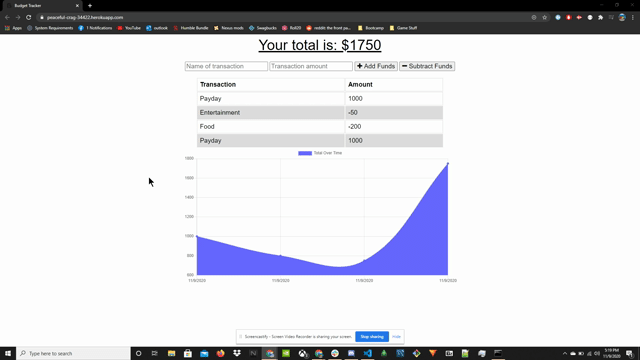
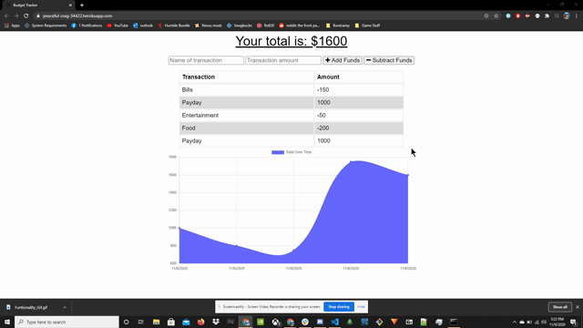

# Budget Tracker PWA

   [](#License)

   ## Description
   The purpose of this app is to create a PWA from a fully functioning application. This will allow you download the app locally and use it even when there is no internet connection. While offline the app will have full functionality with new information being stored in indexedDB. Once it is online again, all of the changes made will get pushed to the MongoDB to be stored.

   ## Table of Contents
   * [Installation](#Installation)
   * [Usage](#Usage)
   * [License](#License)
   * [Tests](#Tests)
   * [Questions](#Questions)
   
   ## Installation
   To install, use the following commands in the terminal:

   ```
   npm install
   ```

   This app uses MongoDB so you will need that installed on your computer, hwoever this readme does not provide the steps for that. I am also using Robo3t for the MongoDB application, but you can use what ever application you wish.

   ## Usage
   Once you have finished the instructions in the Installation section, you can use the following command to start the server:

   ```
   npm start
   ```

   ## License
   The license associated with this project is MIT.
   To view the license information, visit the link [here](https://github.com/CalebParris/Budget-Tracker-PWA/blob/master/LICENSE)

   ## Tests
   After following the directions in the installation and Usage sections, you can test the application as shown below.

   Fillout the fields at the top of the page and either "add funds", or "subtract funds". This will update the total and the graph.

   

   To test offline, inspect the page by right clicking and selecing inspect. Then navigate to the network tab and select "offline" from the drop down.

   

   Once the site is offline, add more transactions like before. This will update the total and graph. After that is completed, switch the network dropdown back to online and refresh the page. You newly added transactions will still be there.

   

   The last thing you can do is click the "+" button in the adress bar if you are on a computer or click the 3 dots on your phone/tablet chrome browser, or equivelant on preferred browser, and select "Add to Home Screen". This will install the application onto you desktop for computers or add to the home screen of your phone/tablet. The PWA will then allow you to continue using the full app no matter if you are connected to the internet or not.

   

   Here is a link to the deployed version of this app:

   [https://peaceful-crag-34422.herokuapp.com/](https://peaceful-crag-34422.herokuapp.com/)

   ## Questions
   If you have any comments, questions, or concerns about this project, please post them [here](https://github.com/CalebParris/Budget-Tracker-PWA/issues) and I will respond as soon as I am able.

   Otherwise, you can contact me through the following means:
   * Email: calebparris@live.com
   * Github: [CalebParris](https://github.com/CalebParris)
    
